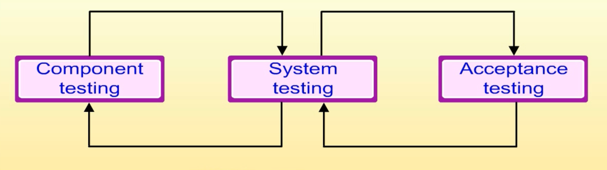

# Traditional Software Processes

## I. Software process models
---
### The software process
* A structured set of activities required to develop a software system

    

* A software process model is an abstract representation of a process. It presents a description of a process from some particular perspective.
---
### Generic software process models
* The waterfall model
    * Separate and distinct phases of specification and development;
    * Suited for large or complex project.
* Evolutionary development
    * Specification, development and validation are interleaved（交織）.
* Component-based software engineering
    * The system is assembled from existing components.
* There are many variants of these models. E.g., formal development where a waterfall-like process is used but the specification is a formal specification that is refined through several stages to an implementation design.
---
### Waterfall model

* Phases:  
    A. Requirements analysis and definition  
    B. System and software design  
    C. Implementation and unit testing  
    D. Integration and system testing  
    E. Operation and maintenance

* Drawback:
    * It's difficult to accommodate change after the process is underway. 
    * One phase has to be complete before moving onto the next phase.

* Applicability:
    * This model is appropriate when the requirements are well-understood and changes will be fairly limited during the design process.

    * Few business systems have stable requirements.

    * The waterfall model is mostly used for large systems engineering projects where a system is developed at several sites.
---
### Evolutionary development
* Exploratory development (探索式開發)
    * Objective is to work with customers and to evolve a final system from an initial outline specification. Should start with well-understood requirements and add new features as proposed by the customer.
* Throw-away prototyping
    * Objective is to understand the system requirements. Could start with poorly understood requirements to clarify what is really needed.

* Drawbacks:
    * Lack of process visibility;
    * Systems are often poorly structured;
    * Special skills (e.g., in languages for rapid prototyping) may be required

* Applicability:
    * For small or medium-size interactive systems;
    * For parts of large systems (e.g., the user interface)
    * For short-lifetime systems.
---
### Component-based software engineering
* Based on systematic reuse where systems are integrated from existing components or COTS (Commercial-Off-The-Shelf) systems.

* This approach is becoming increasingly used as component standards have emerged.
---
### Reused-oriented development

---

## II. Process Iteration

---
### Process iteration
* System requirements ALWAYS evolve in the course of a project so process iteration where earlier stages are reworked is always part of the process for large systems.
* Iteration can be applied to any of the generic process models.
* Two (related) approaches
    * Incremental（增量式） delivery
    * Spiral（螺旋式） development
---
### Incremental delivery
* Rather than deliver the system as a single delivery, the development and delivery is broken down into increments with each increment delivering part of the required functionality.
* User requirements are prioritised and the highest priority requirements are included in early increments.
* Once the development of an increment is started, the requirements are frozen though requirements for later increments can continue to evolve.

* Advantage:
    * Customer value can be delivered with each increment so system functionality is available earlier;
    * Early increments act as a prototype to help elicit(引出) requirements for later increments;
    * Lower risk of overall project failure;
    * The highest priority system services tend to receive the most testing.
---
### Extreme programming
Let increments in incremental delivery be extremely small and numerous.
* An approach to development based on the development and delivery of very small increments of functionality;
* Relies on constant code improvement, user involvement in the development team and pairwise programming;
---
### Spiral development
* Process is represented as a spiral rather than as a sequence of activities with backtracking;
* Each loop in the spiral represents a phase in the process;
* No fixed phases such as specification or design - loops in the spiral are chosen depending on what is required;
* Risks are explicitly assessed and resolved throughout the process.

---
### Spiral model four sectors
* Objective setting
    * Specific objectives for the phase are identified;
    * Objective setting.
* Risk assessment and reduction
    * Risks are assessed and activities put in place to reduce the key risks.
* Development and validation
    * A development model for the system is chosen which can be any of the generic models.
* Planning
    * The project is reviewed and the next phase of the spiral is planned.
---
## III. Process activities

* Software specification
* Software design and implementation
* Software validation
* Software evolution
---
### Software specification
* The process of establishing what services are required and the constraints on the system's operation and development.

* Requirements engineering process
    * Feasibility study
    * Requirements elicitation(引出) and analysis
    * Requirements specification
    * Requirements validation

---
### Software design and implementation

* The process of converting the system specification into an executable system.
* Software design
    * Design a software structure that realizes the specification.
* Implementation
    * Translate this structure into an executable program.
* The activities of design and implementation are closely related and may be inter-leaved.
---
### Design process activities

* Architectural design
* Abstract specification
* Interface design
* Component design
* Data structure design
* Algorithm design

---
### Structured methods

* Systematic approaches to developing a software design;
* The design is usually documented as a set of graphical models;
* Possible models
    * Object model
    * Sequence model
    * State transition model
    * Structural model
    * Data-flow model
---
### Programming and debugging
* Translating a design into a program and removing errors from that program;
* Programming is a personal activity - there is no generic programming process;
* Programmers carry out some program testing to discover faults in the program and remove these faults in the debugging process.

* Noticed: the bug should be reproduced for debugging process.
---
### Software validation
* Verification and validation (V & V) is intended to show that a system conforms(符合) to its specification and meets the requirements of the system customer.

* Involves checking and review processes and system testing.

* System testing involves executing the system with test cases that are derived from the specification of the real data to be processed by the system.

* Component or unit testing
    * Individual components are tested independently;
    * Components may be functions or objects or coherent groupings of these entitles.
* System testing
    * Testing of the system as a whole. Testing of emergent properties is particularly important.
* Acceptance testing
    * Testing with customer data to check that the system meets the customer's needs.

### Software evolution
* Software is inherently flexible and can change;
* As requirements change through changing business circumstances, the software that supports the business must also evolve and change;
* Although there has been a demarcation between development and evolution (maintenance) this is increasingly irrelevant as fewer and fewer systems are completely new.

