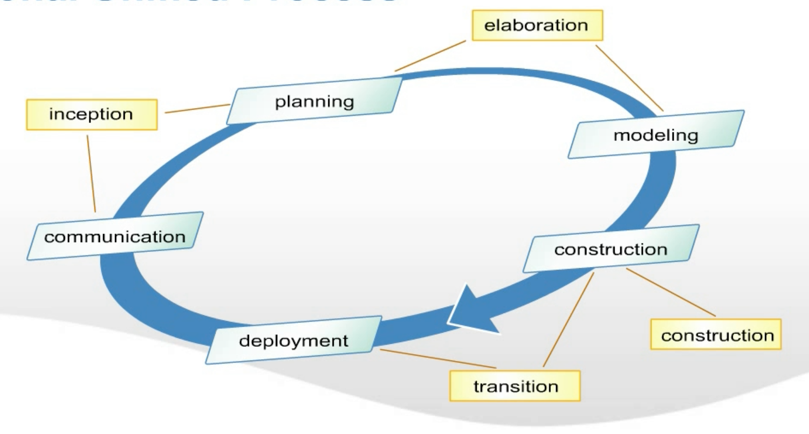
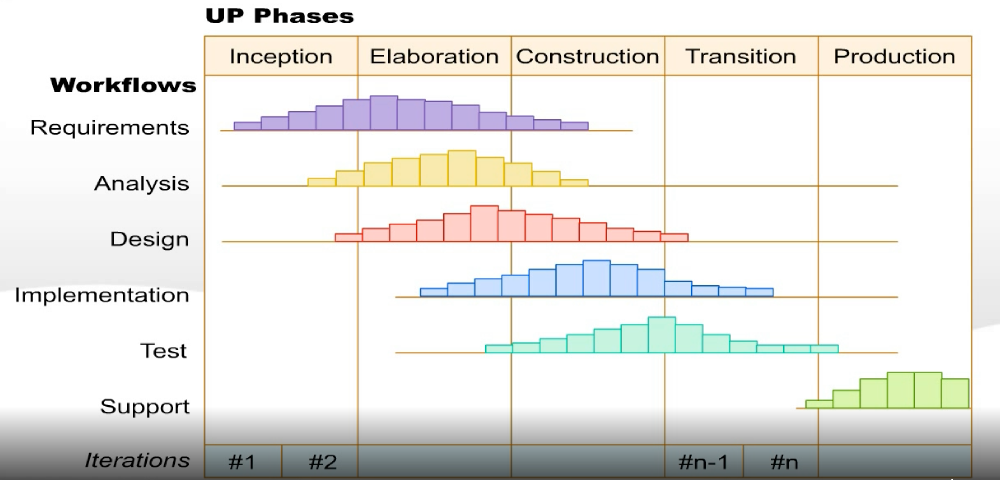
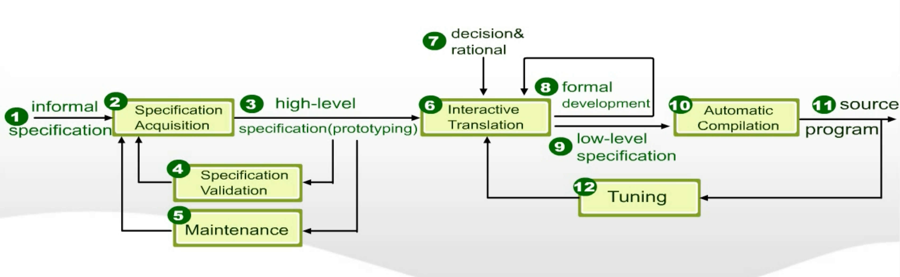
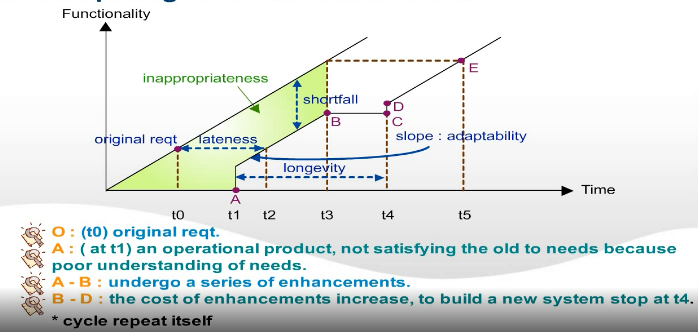
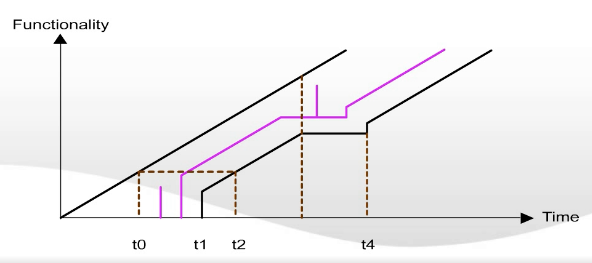
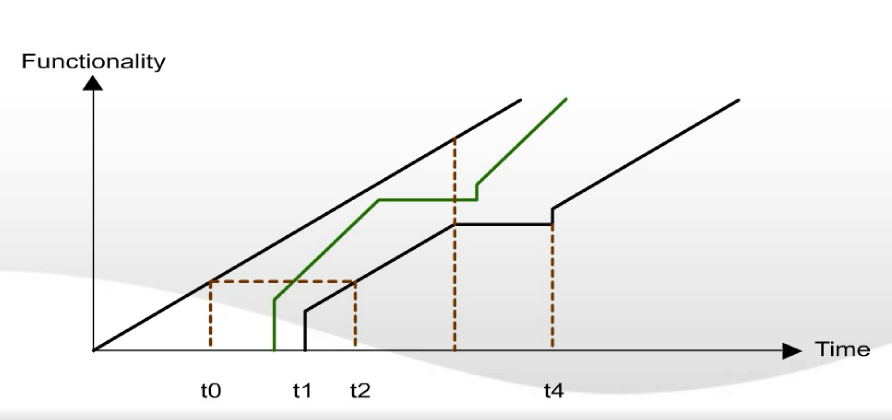
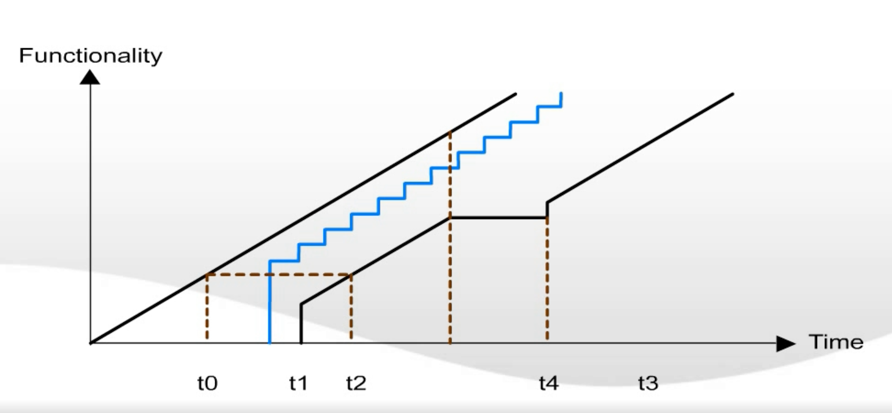
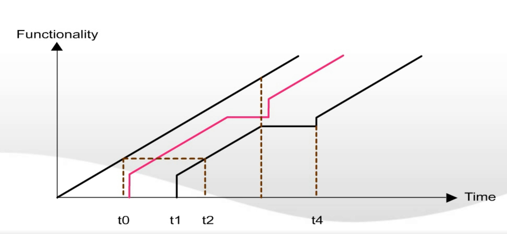
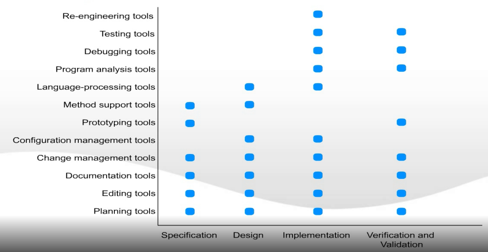
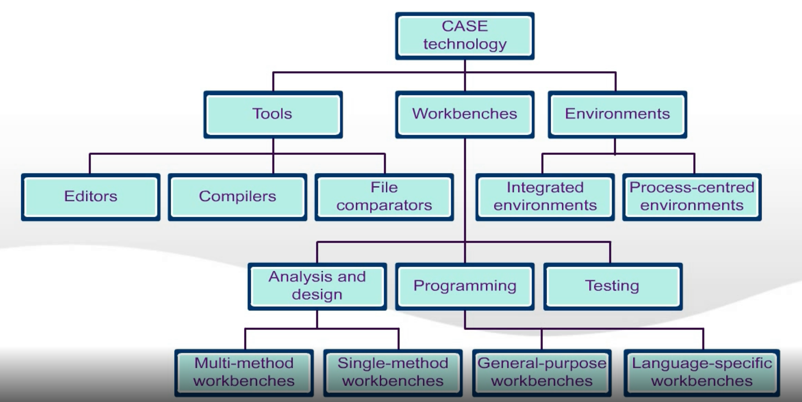

# CH4 Contemporary Software Process

## I. The Rational Unified Process a.k.a. RUP

* A modern process model derived from the work on the UML and associated process
* Normally described from 3 perspectives
    * A dynamic perspective that shows phases over time
    * A static perspective that shows process activities
    * A practice perspective that suggests good practice

---
### RUP phases

* Inception
    * Establish the business case for the system
* Elaboration
    * Develop an understanding of the problem domain and the system architecture
* Construction
    * System design, programming and testing
* Transition
    * Deploy the system in its operating environment
---
### RUP in static perspective view

Keep running the loop until the software becomes stable enough

---
### RUP Work Products

* Inception phase
    * Vision document
    * Initial use-case model
    * Initial project glossary
    * Initial business case
    * Initial risk assessment
    * Project plan
    * phases and iterations
    * Business model, if necessary
    * One or more prototypes

* Elaboration phase
    * Use-case model
    * Supplementary requirements including non functional
    * Analysis model
    * Software architecture description
    * Executable architectural prototype
    * Preliminary//初步的 design model
    * Revised risk list
    * Project plan including
        * iteration plan
        * adapted workflows
        * milestones
        * technical work products
    * Preliminary user manual

* Construction phase
    * Design model
    * Software components
    * Integrated software increment
    * Test plan and procedure
    * Test cases
    * Support documentation
        * user manuals
        * installation manuals
        * description of current increment

* Transition phase
    * Delivered software increment
    * Beta test reports
    * General user feedback

---
### RUP good practice

* Develop software iteratively
* Manage requirements
* Use component-based architectures
* Visually model software
* Verify software quality
* Control changes to software

---
### Static workflows

|Workflow|Description|
|:----|:----|
|Business modeling|The business processes are modelled using business use cases.|
|Requirements|Actors who interact with the system are identified and use cases are developed to model the system requirements.|
|Analysis and design|A design model is created and documented using architectural models, component models, object models and sequence models.|
|Implementation|The components in the system are implemented and structured into implementation sub-systems. Automatic code generation from design models helps accelerate this process.|
|Test|Testing is an iterative process that is carried out in conjunction with implementation. System testing follows the completion of the implementation.|
|Deployment|A product release is created, distributed to users and installed in their workplace.|
|Configuration and change management|This supporting workflow manages to the system.|
|Project management|This supporting workflow manages the system development.|
|Environment|This workflow is concerned with making appropriate software tools available to the software development team.|

---
### Automated Synthesis Model

---
### Comparing Various Process Models

* Waterfall process model
    

* Throwaway Prototyping and Spiral Model
    

* Evolutionary Prototyping
    

* Automated Software Synthesis
    

* Reusable Software versus Conventional
    

## II. Computer-Aided Software Engineering

* Computer-Aided Software Engineering (CASE) is software to support software development and evolution processes.
* Activity automation
    * `Graphical editors` for system model development
    * `Data dictionary` to manage design entities
    * `Graphical UI builder` for user interface construction
    * `Debuggers` to support program fault finding
    * `Automated translators` to generate new versions of a program
---
### CASE technology

* CASE technology has led to significant improvements in the software process. However, these are not the order of magnitude improvements that were once predicted.
    * Software engineering requires creative thought - this is not readily automated;
    * Software engineering is a team activity and, for large projects, much time is spent in team interactions. CASE technology does not really support these.

---
### CASE classification

* Classification helps us understand the different types of CASE tools and their support for process activities.
* Functional perspective
    * Tools are classified according to their specific function.
* Process perspective
    * Tools are classified according to process activities that are supported.
* Integration perspective
    * Tools are classified according to their organization into integrated units.
---
### Functional tool classification

|Tool type|Examples|
|:----|:----|
|Planning tools|PERT tools, estimation tools, spreadsheets|
|Editing tools|Text editors, diagram editors, word processors|
|Change management tools|Requirements traceability tools, change control systems|
|Configuration management tools|Version management systems, system building tools|
|Prototyping tools|Very high-level languages, user interface generators|
|Method-support tools|Design editors, data dictionaries, code generators|
|Language-process tools|Compilers, interpreters|
|Program analysis tools|Cross reference generators, static analyzers, dynamic analyzers|
|Testing tools|Test data generators, file comparators|
|Debugging tools|Interactive debugging systems|
|Documentation tools|Page layout program, image editors|
|Re-engineering tools|Cross-reference systems, program re-structuring systems|

---
### Activity-based tool classification

---
### CASE integration

* Tools
    * Support `individual process tasks` such as design consistency checking, text editing, etc...
* Workbenches
    * Support `a process phase` such as specification or design. Normally include a number of integrated tools.
* Environments
    * Support `all or a part of an entire software process`. Normally include several integrated workbenches.

---
### Tools, workbenches, environments

