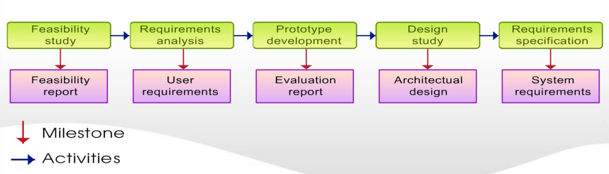

# CH5-2 Project Planning

## Project planning

* Probably the most `time-consuming` project management activity.

* `Continuous activity` from initial concept through to system delivery. Plans must be regularly `revised` as new information becomes available.

* Various `different types of plan` may be developed to support the main software project plan that is concerned with schedule and budget.

* Types of project plan
    * Quality plan
        * Describes the quality procedures and standards that will be used in a project.
    * Validation plan
        * Describes the approach, resources and schedule used for system validation.
    * Configuration management plan
        * Describe the configuration management procedures and structures to be used.
    * Maintenance plan
        * Predicts the maintenance requirements of the system, maintenance costs and effort required.
    * Staff development plan
        * Describes how the skills and experience of the project team members will developed.
---
## Project planning process

    Establish the project constraints
    Make initial assessments of the project parameters
    Define project milestones and deliverables
    Draw up project schedule

    while (project has not been completed or cancelled):
        try:
            Initiate activities according to schedule
            Wait(for a while)
            Review project process
            Revise estimate of project parameters
            Update the project schedule
            Negotiate project constraints and deliverables

        except (problem arise):
            Initiate technical review and possible revision
---
## The project plan

* The project plan sets out:
    * Resources available to the project;
    * The work breakdown;
    * A schedule for the work.

---
## Project plan structure

* Introduction
* Project organization
* Risk analysis
* Hardware and software resource requirements
* Work breakdown
* Project schedule
* Monitoring and reporting mechanisms

---
## Activity organization

* Activities in a project should be organized to produce tangible outputs for management to judge progress.
* Milestones are the end-point of a process activity.
* Deliverables are project results delivered to customers.
* The `waterfall` process allows for the straightforward definition of progress milestones.

---
## Milestones in the RE process

