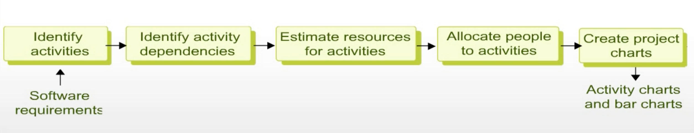
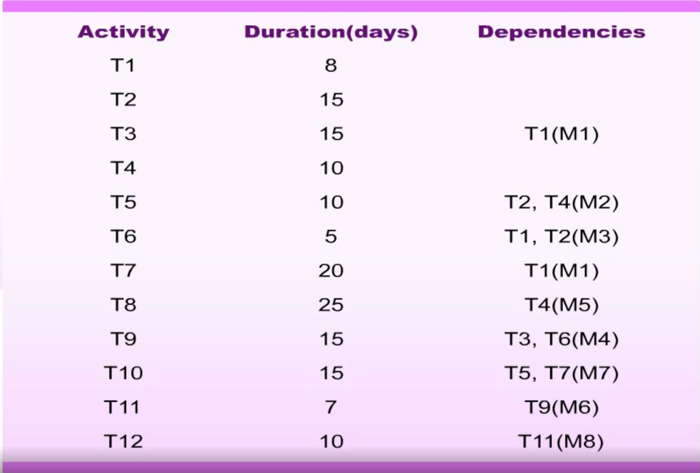
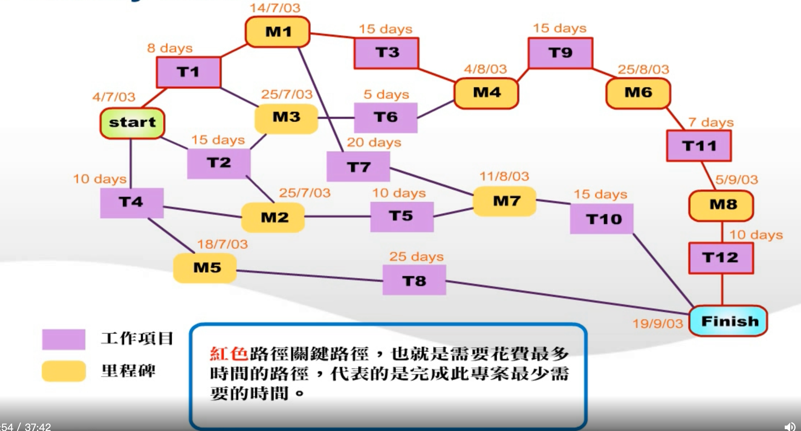
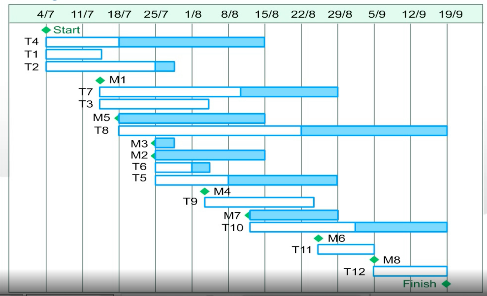
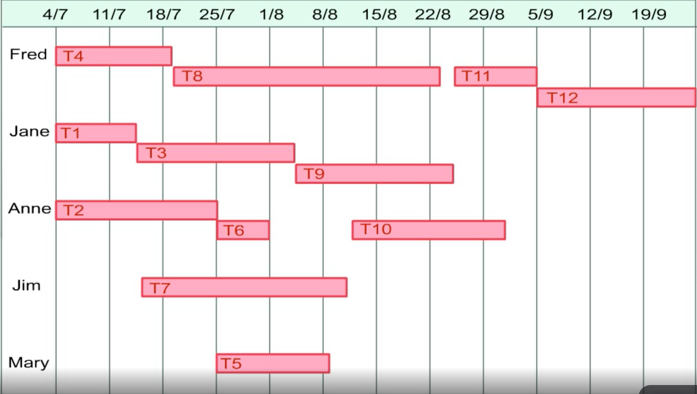

# I. Project Scheduling

## Project scheduling

* Split project into `tasks`, `estimate time` and `resources` required to complete each task.

* Organize tasks `concurrently` to make optimal use of workforce.

* `Minimize task dependencies` to avoid delays caused by one task waiting for another to complete.

* Dependent on `project managers intuition and experience`. 

## Scheduling flow

    software_requirements = get_requirements()
    required_activities = identify_activity(software_requirements)
    is_schedule_ok = False
    while not is_schedule_ok:
        required_people_resource = estimate_resource(required_activities)
        plan = allocate_people_and_resource(required_people_resource)
        activity_charts, bar_charts = create_project_charts(plan)
        is_schedule_ok = check_charts(activity_charts, bar_charts)
    return activity_charts, bar_charts

## Scheduling problems

* `Estimating the difficulty` of problems and hence the cost of developing a solution is hard.
* `Productivity is not proportional` to the number of `people` working on a task.
* Adding people to a late project -> project becomes later: `communication overheads`.
* The unexpected always happens. Always allow `contingency in planning`.

## Bar charts and activity networks

* `Graphical notation`
* Show project `breakdown into tasks`. Tasks should take about a `week` or `two`.
* `Activity charts` show `task dependencies` and the `critical path`.
* `Bar charts` show schedule against `calendar time`.

---
## Example

### Task Table

### Activity Network

### Activity Timeline

### Staff Allocation
