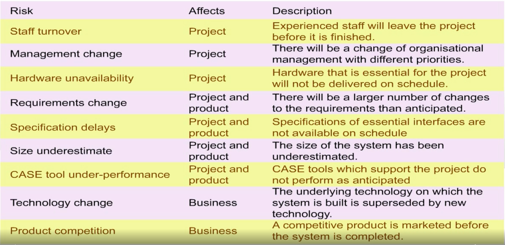
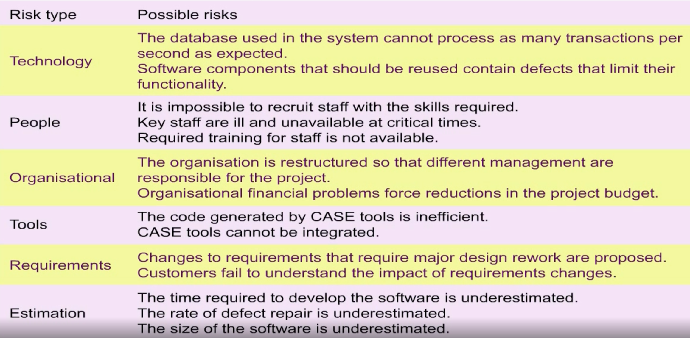
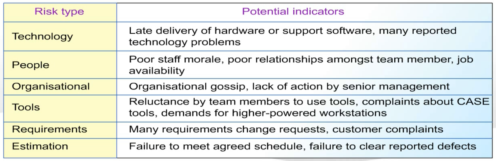

# II. Risk Management

## Risk

* Risk management is concerned with `identifying risks` and drawing up `plans` to minimize their effect on a project.

* `risk`: probability that some adverse(不利的) circumstance(情況) will occur.
    * `Project risks` affect schedule or resources
    * `Product risks` affect the quality or performance of product being developed
    * `Business risks` affect the organization developing or procuring(採購) the software.

### Example

---
## Risk Management Process

* Risk `identification`
    * Identify project, product and business risks
* Risk `analysis`
    * Assess the likelihood and consequences of these risks
* Risk `planning`
    * Draw up plans to avoid or minimize the effects of the risks
* Risk `monitoring`
    * Monitor the risks throughout the project

### Risk management flow

    while not is_project_finished:
        potential_risks = identification()
        prioritized_risk = analysis(potential_risks)
        plans = planning(prioritized_risk)
        try:
            is_project_finished = monitoring(plans)
        except new_circumstance:
            continue
---
## Risk identification

* Technology risks
* People risks
* Organization risks
* Requirements risks
* Estimation risks

---
## Risk analysis

* Assess probability and seriousness of each risk
* Probability may be very low, low, moderate, hight or very high
* Risk effects might be catastrophic, serious, tolerable or insignificant

---
## Risk planning

* Consider each risk and developing a strategy to manage that risk
* `Avoidance strategies`
    * The probability that the risk will arise is reduced
* `Minimization strategies`
    * The impact of the risk on the project or product will be reduced
* `Contingency plans`
    * If the risk arises, contingency plans are plans to deal with that risk
---
## Risk monitoring

* Assess each identified risks regularly to decide whether or not it is becoming `less or more probable`.
* Assess the `effects` of the risk have changed (via risk indicators).
* Key risk should be discussed at management progress meetings.

### Risk indicators

